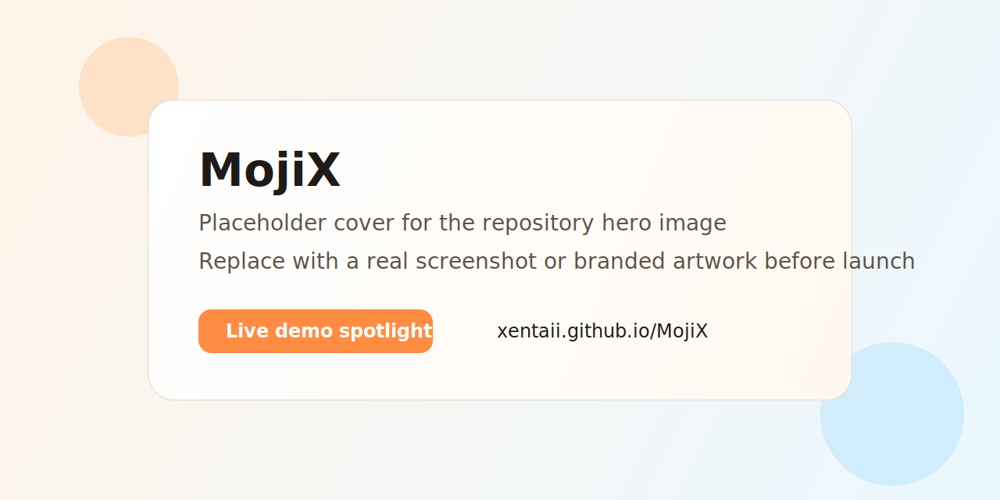

<div align="center">

# MojiX

**A modern React emoji picker that starts small, feels polished, and scales from drop-in UI to fully headless composition.**

[](https://www.npmjs.com/package/mojix-picker)
[](https://www.npmjs.com/package/mojix-picker)
[](https://bundlephobia.com/package/mojix-picker)
[](https://github.com/Xentaii/MojiX/actions/workflows/ci.yml)
[](./LICENSE)
[](https://react.dev)

[Live Demo](https://xentaii.github.io/MojiX/) - [npm](https://www.npmjs.com/package/mojix-picker) - [API Docs](./docs/api/README.md) - [Migration Guide](./docs/MIGRATION.md)

<a href="https://xentaii.github.io/MojiX/">
  
</a>

</div>

> **Start with the live demo.**  
> The fastest way to evaluate MojiX is to open the playground, try the default picker, tweak the theme, switch locales, and see the headless pieces in action:
>
> **[Try the live demo](https://xentaii.github.io/MojiX/)**

MojiX is built for teams that want a real product surface, not just a pile of emoji data:

- a polished default picker you can ship quickly
- a headless composition layer when product needs outgrow the default layout
- CDN-first emoji metadata so the main package stays lean
- an explicit offline preload path for regulated or air-gapped environments
- vendor sprite presets, custom assets, theming hooks, and runtime i18n

## Why teams pick MojiX

- **Fast default path.** `EmojiPicker` works out of the box with search, recents, preview, skin tones, and category navigation.
- **Headless when needed.** `MojiX.*` primitives and engine helpers let you build custom popovers, compact pickers, or app-specific layouts without forking the library.
- **CDN-first by design.** Unicode emoji data and locale packs load lazily from the package CDN mirror instead of bloating the main entry.
- **Offline is still first-class.** Use `mojix-picker/data` and `mojix-picker/locales/<code>` when runtime network access is not allowed.
- **Real integration surface.** Sprite presets, custom asset sources, stable slot hooks, and strong TypeScript support make it practical in production apps.
- **Live playground included.** The demo site is part of the repo workflow and doubles as a review surface for UI, accessibility, and release verification.

## Install

```bash
npm install mojix-picker
```

```tsx
import { EmojiPicker } from 'mojix-picker';
import 'mojix-picker/style.css';
```

`react` and `react-dom` are peer dependencies.

## Package size model

MojiX optimizes for a different tradeoff than ultra-minimal emoji libraries:
the npm package includes the runtime code **and** a CDN/offline-ready
`dist/data/` directory. That means installs are larger than tiny headless
pickers, but consumers get a complete, self-hostable data mirror without adding
another data package.

Current `npm pack --dry-run` comparison:

| Package | Download | Unpacked install | What that usually means |
| --- | ---: | ---: | --- |
| `frimousse@0.3.0` | 67 KB | 257 KB | Smallest install; intentionally minimal package surface |
| `emoji-mart@5.6.0` | 430 KB | 1.63 MB | Smaller package, with data handled separately in many setups |
| `mojix-picker@1.0.0-beta.1` | 1.44 MB | 2.93 MB | Code plus compact emoji data, locale packs, search indexes, and precompressed CDN assets |
| `emoji-picker-react@4.19.0` | 6.54 MB | 34.26 MB | Data-heavy package footprint |

So MojiX is not trying to beat `frimousse` on raw install size. Its advantage
is the middle path: a polished React picker, headless primitives, sprite
presets, runtime localization, CDN-first loading, and explicit offline imports
in one package. Default app bundles still avoid inlining the full emoji dataset
unless you opt into `mojix-picker/data` or locale subpaths.

## Quick start

```tsx
import { EmojiPicker } from 'mojix-picker';
import 'mojix-picker/style.css';

export function ComposerEmojiPicker() {
  return (
    <EmojiPicker
      locale="ru"
      onEmojiSelect={(emoji) => {
        console.log(emoji.native, emoji.shortcodes);
      }}
    />
  );
}
```

On first mount, MojiX loads unicode emoji data and the active locale pack from:

```text
https://cdn.jsdelivr.net/npm/mojix-picker@<version>/data/emoji-data.json
https://cdn.jsdelivr.net/npm/mojix-picker@<version>/data/locales/<code>.json
```

Sprite sheets continue to resolve from the vendor CDN packages:

```text
https://cdn.jsdelivr.net/npm/emoji-datasource-twitter@16.0.0/img/twitter/sheets-256/64.png
```

## Offline preload

If your app must run without runtime network access, preload the package data at
bootstrap:

```tsx
import emojiData from 'mojix-picker/data';
import ruLocale from 'mojix-picker/locales/ru';
import twitterSprites from 'mojix-picker/sprites/twitter';
import {
  EmojiPicker,
  preloadEmojiData,
  registerEmojiLocalePack,
} from 'mojix-picker';

preloadEmojiData(emojiData);
registerEmojiLocalePack('ru', ruLocale);

<EmojiPicker locale="ru" spriteSheet={twitterSprites} />;
```

## Headless API

```tsx
import { MojiX } from 'mojix-picker';

<MojiX.Root locale="ru" columns={9}>
  <MojiX.Search />

  <MojiX.Viewport>
    <MojiX.Loading />
    <MojiX.Empty />
    <MojiX.List />
  </MojiX.Viewport>

  <MojiX.Footer>
    <MojiX.SkinToneButton />
    <MojiX.ActiveEmoji />
  </MojiX.Footer>

  <MojiX.CategoryNav />
</MojiX.Root>;
```

Primitives:

- `MojiX.Root`
- `MojiX.Search`
- `MojiX.Viewport`
- `MojiX.List`
- `MojiX.Empty`
- `MojiX.Loading`
- `MojiX.Footer`
- `MojiX.CategoryNav`
- `MojiX.ActiveEmoji`
- `MojiX.SkinTone`
- `MojiX.SkinToneButton`

Hooks:

- `useMojiX`
- `useEmojiSearch`
- `useEmojiCategories`
- `useEmojiSelection`
- `useActiveEmoji`
- `useSkinTone`
- `useEmojiAssets`

## Asset sources

```tsx
import {
  EmojiPicker,
  createEmojiSpriteSheet,
  createSpriteSheetAssetSource,
  createSvgAssetSource,
} from 'mojix-picker';

<EmojiPicker
  spriteSheet={createEmojiSpriteSheet({
    source: 'cdn',
    vendor: 'twitter',
    sheetSize: 64,
    variant: 'indexed-256',
  })}
  gridAssetSource={createSpriteSheetAssetSource()}
  previewAssetSource={createSvgAssetSource({
    resolveUrl: ({ emoji }) => `/emoji/svg/${emoji.id}.svg`,
  })}
/>;
```

Factories:

- `createNativeAssetSource`
- `createSpriteSheetAssetSource`
- `createImageAssetSource`
- `createSvgAssetSource`
- `createMixedAssetSource`

## Localization

```tsx
<EmojiPicker
  locale="ru"
  fallbackLocale={['en']}
  locales={{
    ru: {
      labels: { searchPlaceholder: 'Find emoji' },
    },
  }}
/>
```

- Built-in chrome locales: `en`, `de`, `es`, `fr`, `ja`, `pt`, `ru`, `uk`
- Setting `locale="ru"` loads that locale's emoji translation pack on demand
- Offline apps can register packs from `mojix-picker/locales/<code>`
- `emojiPickerLocales` reflects only locale packs explicitly registered in the current runtime

## Loading and errors

MojiX shows `MojiX.Loading` while unicode emoji data is loading. If the CDN
request fails, observe it through `onDataError`:

```tsx
<EmojiPicker
  onDataError={(error) => {
    console.error('Failed to load emoji data', error);
  }}
/>
```

## SSR

MojiX reads browser APIs such as `window`, `localStorage`, and Cache Storage.
Mount it from a client boundary in SSR frameworks.

```tsx
// Next.js App Router
'use client';
export { EmojiPicker } from 'mojix-picker';
```

```tsx
// Next.js Pages Router
import dynamic from 'next/dynamic';

export const EmojiPicker = dynamic(
  () => import('mojix-picker').then((mod) => mod.EmojiPicker),
  { ssr: false },
);
```

## Development

```bash
git clone https://github.com/Xentaii/MojiX
cd MojiX
npm install
npm run emoji:data
npm run dev
```

Key scripts:

| Script | Purpose |
| --- | --- |
| `npm run dev` | Start the live playground |
| `npm run emoji:data` | Regenerate `src/core/generated/` from CLDR + `emoji-datasource` |
| `npm run typecheck` | Run strict TypeScript checks |
| `npm run test` | Run Vitest |
| `npm run test:e2e` | Run Playwright |
| `npm run build:demo` | Build the demo app |
| `npm run build:lib` | Build the publishable library (ESM + types) |
| `npm run build:package` | Regenerate data and build package artifacts |
| `npm run pack:check` | Verify `npm pack --dry-run` output |

Published packages ship `dist/lib/` plus `dist/data/`. The main entry stays
code-only, and `dist/data/` powers both jsDelivr delivery and offline subpath
imports.

## Project structure

```text
src/
|-- components/              React layer and UI primitives
|-- core/                    Engine, async data store, i18n, sprite helpers
|-- entries/                 Offline subpath modules and sprite presets
|-- demo/                    Playground and test fixtures
`-- index.ts                 Public entry
scripts/
`-- build-emoji-data.mjs     Generator for src/core/generated/*
```

`src/core/generated/` is a build artifact. Regenerate it with `npm run emoji:data`.

## Screenshots and cover placeholders

- Repository cover placeholder: [docs/assets/repo-cover-placeholder.svg](./docs/assets/repo-cover-placeholder.svg)
- Live demo placeholder: [docs/assets/live-demo-placeholder.svg](./docs/assets/live-demo-placeholder.svg)

These are intentionally lightweight placeholders so the repo already has stable
paths for future marketing assets.

## Docs

- [Live Demo](https://xentaii.github.io/MojiX/)
- [API reference](./docs/api/README.md)
- [Migration Guide](./docs/MIGRATION.md)
- [Bundle size roadmap](./docs/BUNDLE_SIZE_ROADMAP.md)
- [Headless API roadmap](./docs/HEADLESS_API_ROADMAP.md)
- [Release notes: 1.0.0-beta.1](./docs/releases/1.0.0-beta.1.md)
- [Generation rules](./scripts/README.md)
- [Changelog](./CHANGELOG.md)
- [Contributing](./CONTRIBUTING.md)

## License

[MIT](./LICENSE)
